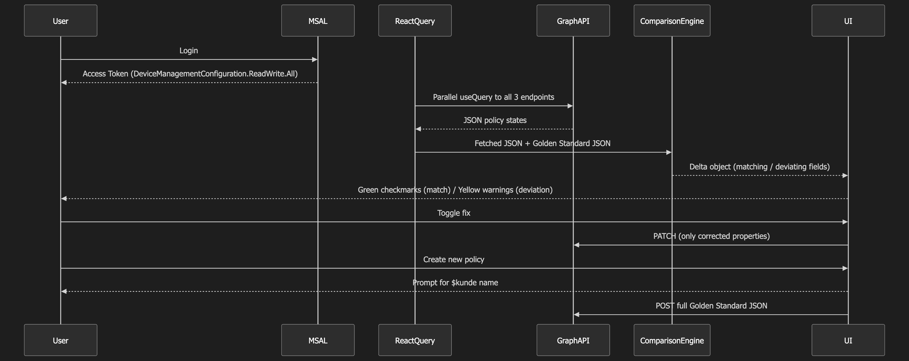

# InTuneUp


<p align="center">Version 1.0.0</p>

[](https://react.dev)
[](https://www.typescriptlang.org)
[](https://learn.microsoft.com/en-us/mem/intune/)
[](https://azure.microsoft.com/services/app-service/static/)
[](https://opensource.org/licenses/MIT)

A React application that helps MSPs manage Microsoft Intune Windows Update configurations. Compare existing policies against your golden standard, fix deviations with one click, or deploy new standard policies to your Intune tenant.

## Features

- Sign in with Microsoft Entra ID (Azure AD) using MSAL
- View all Windows Update policies in one place
- Automatically checks each policy against your golden standard
- Patch patchable deviations directly from the UI
- Create new policies from your golden standard templates

## Application Workflow



## Supported Policy Types

- Update Rings (Windows Update for Business)
- Feature Update Policies
- Expedite Policies (Quality Updates)
- Quality Update Policies

## Tech Stack

- React 19 with TypeScript
- Vite for build tooling
- Microsoft Authentication Library (MSAL) for Entra ID auth
- TanStack React Query for data fetching
- shadcn/ui + Tailwind CSS for the interface
- Microsoft Graph API (beta endpoint)

## Getting Started

1. Install dependencies:
   ```bash
   npm install
   ```

2. Copy the environment example:
   ```bash
   cp .env.example .env
   ```

3. Configure your Entra ID app registration in `.env`:
   ```
   VITE_AZURE_CLIENT_ID=your-client-id
   VITE_AZURE_TENANT_ID=organizations
   VITE_AZURE_REDIRECT_URI=http://localhost:5173
   ```

4. Start the development server:
   ```bash
   npm run dev
   ```

## Azure Setup

Create an app registration in Microsoft Entra ID:

1. Go to App Registrations > New Registration
2. Choose Accounts in any organizational directory (Multitenant)
3. Add a Redirect URI as Single Page Application: `http://localhost:5173`
4. Under API Permissions, add `DeviceManagementConfiguration.ReadWrite.All` (Delegated)
5. Enable Access tokens and ID tokens in Authentication

## Project Structure

```
src/
├── components/          # UI components
│   ├── Dashboard.tsx    # Main policy dashboard
│   └── ui/              # shadcn/ui components
├── hooks/               # Custom React hooks
│   └── useIntunePolicies.ts
├── services/            # Graph API service layer
│   ├── authConfig.ts
│   └── graphService.ts
├── types/               # TypeScript type definitions
│   └── graph.ts
└── utils/               # Utilities
    └── comparisonEngine.ts   # Policy comparison logic
```

## Available Scripts

- `npm run dev` - Start development server
- `npm run build` - Build for production
- `npm run lint` - Run ESLint

## License

MIT

