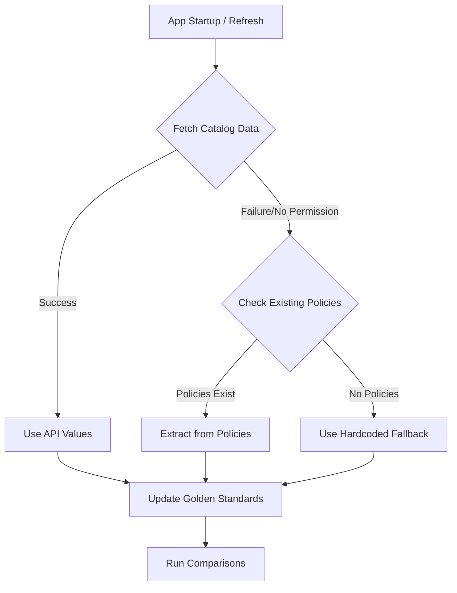

# Dynamic Update Version Retrieval Design

## Problem Statement

The application currently has hardcoded values for Windows update versions in the comparison engine:

| Value | Location | Current Hardcoded Value |
|-------|----------|------------------------|
| `featureUpdateVersion` | [`GOLDEN_FEATURE_UPDATE`](../src/utils/comparisonEngine.ts:47) | `'Windows 11, version 25H2'` |
| `qualityUpdateRelease` | [`GOLDEN_EXPEDITE_POLICY`](../src/utils/comparisonEngine.ts:58) | `'02/10/2026 - 2026.02 B'` |

These values become stale as Microsoft releases new Windows versions and security updates. This document outlines approaches to make these values dynamic.

---

## Current Implementation Analysis

### Where Hardcoded Values Are Used

#### 1. Feature Update Version

Defined in [`src/utils/comparisonEngine.ts`](../src/utils/comparisonEngine.ts:43-50):

```typescript
export const GOLDEN_FEATURE_UPDATE: Omit<WindowsFeatureUpdateProfile, 'id'> = {
  '@odata.type': '#microsoft.graph.windowsFeatureUpdateProfile',
  displayName: 'default_aad_kunde_win-feature',
  description: 'No Description',
  featureUpdateVersion: 'Windows 11, version 25H2',  // <-- HARDCODED
  installFeatureUpdatesOptional: false,
  installLatestWindows10OnWindows11IneligibleDevice: false,
};
```

Used by:
- [`compareFeatureUpdates()`](../src/utils/comparisonEngine.ts:327) - compares policies against golden standard
- [`deployMutation`](../src/components/Dashboard.tsx:459-463) - creates new feature update profiles

#### 2. Quality Update Release

Defined in [`src/utils/comparisonEngine.ts`](../src/utils/comparisonEngine.ts:52-61):

```typescript
export const GOLDEN_EXPEDITE_POLICY: Omit<WindowsQualityUpdateProfile, 'id'> = {
  '@odata.type': '#microsoft.graph.windowsQualityUpdateProfile',
  displayName: 'default_aad_kunde_win-expedite',
  description: 'Emergency hotpatch expedite',
  expeditedUpdateSettings: {
    '@odata.type': 'microsoft.graph.expeditedWindowsQualityUpdateSettings',
    qualityUpdateRelease: '02/10/2026 - 2026.02 B',  // <-- HARDCODED
    daysUntilForcedReboot: 2,
  },
};
```

**Note**: A partial solution already exists for quality updates:
- [`extractNewestQualityUpdateRelease()`](../src/utils/comparisonEngine.ts:85-112) - extracts newest release from existing policies
- [`createGoldenExpeditePolicy()`](../src/utils/comparisonEngine.ts:67-78) - creates golden policy with dynamic value
- [`compareExpeditePolicies()`](../src/utils/comparisonEngine.ts:351) - accepts optional `newestQualityUpdate` parameter

The Dashboard already uses this dynamic extraction at [line 378](../src/components/Dashboard.tsx:378):

```typescript
const newestQualityUpdate = extractNewestQualityUpdateRelease(expeditePolicies);
const expediteResults = compareExpeditePolicies(expeditePolicies, newestQualityUpdate);
```

---

## Graph API Options for Dynamic Retrieval

### Option A: Windows Autopatch Catalog API

**Endpoint**: `GET /admin/windows/updates/catalog/entries`

This API provides a catalog of available Windows updates:

#### Feature Updates

```http
GET https://graph.microsoft.com/beta/admin/windows/updates/catalog/entries?$filter=isof('microsoft.graph.windowsUpdates.featureUpdateCatalogEntry')&$orderby=releaseDateTime desc&$top=1
```

Response includes:
```json
{
  "@odata.type": "#microsoft.graph.windowsUpdates.featureUpdateCatalogEntry",
  "id": "c1dec151-c151-c1de-51c1-dec151c1dec1",
  "displayName": "Feature Update to Windows 11, version 25H2",
  "releaseDateTime": "2025-07-11T00:00:00Z",
  "version": "Windows 11, version 25H2"
}
```

The `version` property matches the format expected by `featureUpdateVersion`.

#### Quality Updates

```http
GET https://graph.microsoft.com/beta/admin/windows/updates/catalog/entries?$filter=isof('microsoft.graph.windowsUpdates.qualityUpdateCatalogEntry') and microsoft.graph.windowsUpdates.qualityUpdateCatalogEntry/isExpeditable eq true&$orderby=releaseDateTime desc&$top=1
```

Response includes:
```json
{
  "@odata.type": "#microsoft.graph.windowsUpdates.qualityUpdateCatalogEntry",
  "id": "d0c03fbb-43b9-4dff-840b-974ef227384d",
  "displayName": "02/10/2026 - 2026.02 B SecurityUpdate for Windows 10 and later",
  "shortName": "2026.02 B",
  "releaseDateTime": "2026-02-10T00:00:00Z",
  "isExpeditable": true,
  "qualityUpdateClassification": "security"
}
```

The `displayName` property matches the format expected by `qualityUpdateRelease`.

#### Permission Requirements

| Permission | Current App | Required |
|------------|-------------|----------|
| `DeviceManagementConfiguration.ReadWrite.All` | ✅ Yes | ✅ Yes |
| `WindowsUpdates.ReadWrite.All` | ❌ No | ✅ **Required** |

**Trade-off**: Requires additional API permission that must be granted by tenant administrators.

### Option B: Extract from Existing Policies (Current Partial Solution)

The application already implements this for quality updates via [`extractNewestQualityUpdateRelease()`](../src/utils/comparisonEngine.ts:85-112).

**Pros**:
- No additional permissions required
- Uses data already fetched from the tenant
- Works with current architecture

**Cons**:
- Only works if policies already exist in the tenant
- Falls back to hardcoded values when no policies exist
- Feature update version extraction not yet implemented

### Option C: Configuration-Based Approach

Store version values in a configuration file or environment variables that can be updated without code changes.

**Pros**:
- Simple to implement
- No additional API calls or permissions
- Can be updated by administrators

**Cons**:
- Still requires manual updates
- Not truly dynamic
- Configuration must be maintained per environment

---

## Recommended Approach

### Hybrid Solution: API-First with Fallback

Implement a tiered approach that prioritizes accuracy while maintaining reliability:



### Implementation Steps

#### 1. Add New Types for Catalog Entries

Create types in [`src/types/graph.ts`](../src/types/graph.ts):

```typescript
// Windows Autopatch Catalog Types
export interface CatalogEntry {
  id: string;
  displayName: string;
  releaseDateTime: string;
  deployableUntilDateTime?: string | null;
}

export interface FeatureUpdateCatalogEntry extends CatalogEntry {
  '@odata.type': '#microsoft.graph.windowsUpdates.featureUpdateCatalogEntry';
  version: string;
}

export interface QualityUpdateCatalogEntry extends CatalogEntry {
  '@odata.type': '#microsoft.graph.windowsUpdates.qualityUpdateCatalogEntry';
  shortName: string;
  isExpeditable: boolean;
  qualityUpdateClassification: 'security' | 'nonSecurity';
}

export type CatalogEntryType = FeatureUpdateCatalogEntry | QualityUpdateCatalogEntry;

export interface CatalogEntriesResponse {
  '@odata.context'?: string;
  value: CatalogEntryType[];
}
```

#### 2. Add Catalog API Functions

Add to [`src/services/graphService.ts`](../src/services/graphService.ts):

```typescript
// ============================================================
// Windows Autopatch Catalog - Update Version Discovery
// ============================================================

const CATALOG_ENDPOINT = '/admin/windows/updates/catalog/entries';

export async function fetchLatestFeatureUpdate(): Promise<string | null> {
  try {
    const response = await graphGet<ODataListResponse<FeatureUpdateCatalogEntry>>(
      `${CATALOG_ENDPOINT}?$filter=isof('microsoft.graph.windowsUpdates.featureUpdateCatalogEntry')&$orderby=releaseDateTime desc&$top=1`
    );
    return response.value[0]?.version ?? null;
  } catch (error) {
    console.error('[GraphService] Failed to fetch feature update catalog:', error);
    return null;
  }
}

export async function fetchLatestQualityUpdate(): Promise<string | null> {
  try {
    const response = await graphGet<ODataListResponse<QualityUpdateCatalogEntry>>(
      `${CATALOG_ENDPOINT}?$filter=isof('microsoft.graph.windowsUpdates.qualityUpdateCatalogEntry') and microsoft.graph.windowsUpdates.qualityUpdateCatalogEntry/isExpeditable eq true&$orderby=releaseDateTime desc&$top=1`
    );
    return response.value[0]?.displayName ?? null;
  } catch (error) {
    console.error('[GraphService] Failed to fetch quality update catalog:', error);
    return null;
  }
}
```

#### 3. Create Update Version Hook

Create new file `src/hooks/useUpdateVersions.ts`:

```typescript
import { useQuery } from '@tanstack/react-query';
import { fetchLatestFeatureUpdate, fetchLatestQualityUpdate } from '../services/graphService';

export const QUERY_KEYS = {
  featureUpdateVersion: ['intune', 'featureUpdateVersion'] as const,
  qualityUpdateVersion: ['intune', 'qualityUpdateVersion'] as const,
};

export interface UpdateVersionsResult {
  featureUpdateVersion: string | null;
  qualityUpdateVersion: string | null;
  isLoading: boolean;
  isError: boolean;
  refetch: () => void;
}

// Hardcoded fallbacks
const DEFAULT_FEATURE_VERSION = 'Windows 11, version 25H2';
const DEFAULT_QUALITY_RELEASE = '02/10/2026 - 2026.02 B';

export function useUpdateVersions(): UpdateVersionsResult {
  const featureQuery = useQuery({
    queryKey: QUERY_KEYS.featureUpdateVersion,
    queryFn: fetchLatestFeatureUpdate,
    retry: 1,
    staleTime: 1000 * 60 * 60, // 1 hour
  });

  const qualityQuery = useQuery({
    queryKey: QUERY_KEYS.qualityUpdateVersion,
    queryFn: fetchLatestQualityUpdate,
    retry: 1,
    staleTime: 1000 * 60 * 60, // 1 hour
  });

  return {
    featureUpdateVersion: featureQuery.data,
    qualityUpdateVersion: qualityQuery.data,
    isLoading: featureQuery.isLoading || qualityQuery.isLoading,
    isError: featureQuery.isError || qualityQuery.isError,
    refetch: () => {
      void featureQuery.refetch();
      void qualityQuery.refetch();
    },
  };
}

// Helper to get effective versions with fallback chain
export function getEffectiveVersions(
  apiVersions: { featureUpdateVersion: string | null; qualityUpdateVersion: string | null },
  existingPolicies: { featureUpdates: { featureUpdateVersion?: string }[]; expeditePolicies: { expeditedUpdateSettings?: { qualityUpdateRelease?: string } }[] }
): { featureUpdateVersion: string; qualityUpdateVersion: string } {
  // Feature update: API > Latest existing policy > Hardcoded
  const featureUpdateVersion = 
    apiVersions.featureUpdateVersion ??
    existingPolicies.featureUpdates[0]?.featureUpdateVersion ??
    DEFAULT_FEATURE_VERSION;

  // Quality update: API > Extract from existing > Hardcoded
  const qualityUpdateVersion = 
    apiVersions.qualityUpdateVersion ??
    extractNewestQualityRelease(existingPolicies.expeditePolicies) ??
    DEFAULT_QUALITY_RELEASE;

  return { featureUpdateVersion, qualityUpdateVersion };
}

function extractNewestQualityRelease(policies: { expeditedUpdateSettings?: { qualityUpdateRelease?: string } }[]): string | null {
  // Similar logic to existing extractNewestQualityUpdateRelease
  // ... implementation
  return null;
}
```

#### 4. Modify Comparison Engine

Update [`src/utils/comparisonEngine.ts`](../src/utils/comparisonEngine.ts) to accept dynamic versions:

```typescript
// Add factory functions
export function createGoldenFeatureUpdate(featureUpdateVersion: string): Omit<WindowsFeatureUpdateProfile, 'id'> {
  return {
    '@odata.type': '#microsoft.graph.windowsFeatureUpdateProfile',
    displayName: 'default_aad_kunde_win-feature',
    description: 'No Description',
    featureUpdateVersion,
    installFeatureUpdatesOptional: false,
    installLatestWindows10OnWindows11IneligibleDevice: false,
  };
}

// Update compareFeatureUpdates to accept dynamic version
export function compareFeatureUpdates(
  policies: WindowsFeatureUpdateProfile[],
  featureUpdateVersion?: string
): PolicyComparisonResult[] {
  const golden = featureUpdateVersion 
    ? createGoldenFeatureUpdate(featureUpdateVersion)
    : GOLDEN_FEATURE_UPDATE;
  
  // ... rest of comparison logic
}
```

#### 5. Update Dashboard Component

Modify [`src/components/Dashboard.tsx`](../src/components/Dashboard.tsx) to use dynamic versions:

```typescript
// Add to imports
import { useUpdateVersions, getEffectiveVersions } from '../hooks/useUpdateVersions';

// In Dashboard component
const { featureUpdateVersion, qualityUpdateVersion, isLoading: versionsLoading } = useUpdateVersions();

// Compute effective versions with fallback
const effectiveVersions = getEffectiveVersions(
  { featureUpdateVersion, qualityUpdateVersion },
  { featureUpdates, expeditePolicies }
);

// Use in comparisons
const featureUpdateResults = compareFeatureUpdates(featureUpdates, effectiveVersions.featureUpdateVersion);
const expediteResults = compareExpeditePolicies(expeditePolicies, effectiveVersions.qualityUpdateVersion);
```

---

## Permission Changes Required

### Azure App Registration Update

Add the following permission to the app registration:

| API | Permission | Type | Description |
|-----|------------|------|-------------|
| Microsoft Graph | `WindowsUpdates.ReadWrite.All` | Delegated | Read Windows update catalog entries |

### authConfig.ts Update

Update [`src/services/authConfig.ts`](../src/services/authConfig.ts) to request the new scope:

```typescript
export const loginRequest = {
  scopes: [
    'User.Read',
    'DeviceManagementConfiguration.ReadWrite.All',
    'WindowsUpdates.ReadWrite.All',  // Add this scope
  ],
};
```

---

## App Lifecycle Integration

### When to Fetch Versions

| Trigger | Action |
|---------|--------|
| App startup | Fetch versions on initial load |
| Manual refresh | Refetch versions when user clicks refresh button |
| Sign-in | Fetch versions after successful authentication |
| Cache expiry | React Query refetches based on `staleTime` |

### Loading States

The UI should show a loading indicator while version data is being fetched. Consider:

1. **Parallel loading**: Fetch versions alongside policy data
2. **Progressive enhancement**: Show policies immediately, update comparisons when versions arrive
3. **Error resilience**: If version fetch fails, use fallback values silently

---

## Trade-offs and Considerations

### API Approach Trade-offs

| Aspect | Pros | Cons |
|--------|------|------|
| Accuracy | Always shows latest available versions | May show versions not yet approved for use |
| Permissions | Official Microsoft API | Requires additional admin consent |
| Reliability | Microsoft-maintained data | API may have outages |
| Complexity | Standard REST integration | Additional error handling needed |

### Fallback Strategy

The recommended fallback chain ensures the app always has valid values:

1. **API values** - Most accurate, requires permission
2. **Existing policies** - Tenant-specific, no extra permission
3. **Hardcoded defaults** - Always available, may be outdated

### Version Selection Policy

Consider whether the "latest" version is always the right choice:

- Some organizations may want to stay on specific versions
- Feature updates have different readiness levels
- Quality updates may have known issues

**Future enhancement**: Allow administrators to configure version preferences.

---

## Testing Strategy

### Unit Tests

1. Test `extractNewestQualityUpdateRelease()` with various policy data
2. Test `getEffectiveVersions()` fallback chain
3. Test comparison engine with dynamic versions

### Integration Tests

1. Mock catalog API responses
2. Test permission denied scenarios
3. Test network failure handling

### Manual Testing

1. Test with tenant that has `WindowsUpdates.ReadWrite.All` permission
2. Test with tenant that lacks the permission
3. Test with empty tenant (no existing policies)

---

## Implementation Checklist

- [ ] Add catalog entry types to `src/types/graph.ts`
- [ ] Add catalog API functions to `src/services/graphService.ts`
- [ ] Create `src/hooks/useUpdateVersions.ts` hook
- [ ] Add `createGoldenFeatureUpdate()` factory function
- [ ] Update `compareFeatureUpdates()` to accept dynamic version
- [ ] Update Dashboard to use dynamic versions
- [ ] Add `WindowsUpdates.ReadWrite.All` scope to auth config
- [ ] Update `.env.example` with permission documentation
- [ ] Add unit tests for new functions
- [ ] Update DESIGN.md with new architecture

---

## References

- [Windows Autopatch Catalog API](https://learn.microsoft.com/graph/api/windowsupdates-catalog-list-entries)
- [Feature Update Catalog Entry](https://learn.microsoft.com/graph/api/resources/windowsupdates-featureupdatecatalogentry)
- [Quality Update Catalog Entry](https://learn.microsoft.com/graph/api/resources/windowsupdates-qualityupdatecatalogentry)
- [Windows Updates API Overview](https://learn.microsoft.com/graph/windowsupdates-concept-overview)
