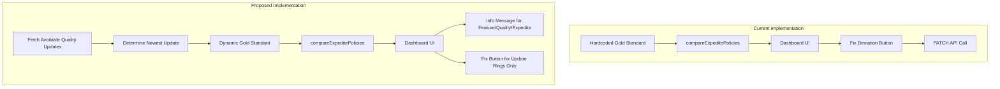

# Expedite Policy Improvements - Design Document

## Executive Summary

This document outlines the design for two improvements to the InTuneUp application:

1. **Dynamic Quality Update Selection**: Auto-select the newest available quality update for expedite policy gold standard instead of using a hardcoded value.

2. **Fix Deviation Button Replacement**: Replace the "Fix Deviation" button with an informational message for Feature, Quality, and Expedite policy types due to Graph API limitations.

---

## Current Implementation Analysis

### Issue 1: Hardcoded Quality Update in Gold Standard

**Location**: [`src/utils/comparisonEngine.ts:52-61`](src/utils/comparisonEngine.ts:52)

```typescript
export const GOLDEN_EXPEDITE_POLICY: Omit<WindowsQualityUpdateProfile, 'id'> = {
  '@odata.type': '#microsoft.graph.windowsQualityUpdateProfile',
  displayName: 'default_aad_kunde_win-expedite',
  description: 'Emergency hotpatch expedite',
  expeditedUpdateSettings: {
    '@odata.type': 'microsoft.graph.expeditedWindowsQualityUpdateSettings',
    qualityUpdateRelease: '02/10/2026 - 2026.02 B',  // <-- HARDCODED
    daysUntilForcedReboot: 1,
  },
};
```

**Problem**: The `qualityUpdateRelease` field is hardcoded to `'02/10/2026 - 2026.02 B'`. Quality updates are released monthly, making this value stale over time.

**Data Flow**:
1. [`useIntunePolicies`](src/hooks/useIntunePolicies.ts:33) hook fetches expedite policies via [`fetchQualityUpdateProfiles`](src/services/graphService.ts:186)
2. [`compareExpeditePolicies`](src/utils/comparisonEngine.ts:279) compares against `GOLDEN_EXPEDITE_POLICY`
3. Deviations are shown in the Dashboard UI

### Issue 2: Fix Deviation Button for All Policy Types

**Location**: [`src/components/Dashboard.tsx:156-179`](src/components/Dashboard.tsx:156)

```typescript
{!result.isFullyCompliant && (
  <div className="space-y-2">
    {result.fields.some((f) => !f.isMatch && !f.isPatchable) && (
      <p className="text-xs text-orange-400">
        ⚠ Some deviations require manual fix in Intune portal
      </p>
    )}
    {result.fields.some((f) => !f.isMatch && f.isPatchable) && (
      <Button
        size="sm"
        onClick={() => onFixDeviation(result)}
        disabled={isFixing}
        className="bg-yellow-600 hover:bg-yellow-700 text-white w-full"
      >
        {isFixing ? (
          <Loader2 className="h-4 w-4 animate-spin mr-2" />
        ) : (
          <Wrench className="h-4 w-4 mr-2" />
        )}
        Fix Deviation
      </Button>
    )}
  </div>
)}
```

**Problem**: The "Fix Deviation" button appears for all policy types with patchable deviations. Due to Graph API limitations with Feature, Quality, and Expedite policies, fixing deviations via PATCH is problematic.

---

## Proposed Solutions

### Solution 1: Dynamic Quality Update Selection

#### Approach A: Fetch Available Quality Updates from Graph API

**Research Required**: The Microsoft Graph API provides access to Windows Update catalog data. Need to identify the correct endpoint for fetching available quality updates.

**Potential Endpoints** (needs verification):
- `/deviceManagement/windowsQualityUpdateProfiles` - Lists profiles, not available updates
- May need to query Windows Update for Business deployment service endpoints

**Implementation Steps**:

1. **Add new API function** in [`graphService.ts`](src/services/graphService.ts):
   ```typescript
   // New function to fetch available quality updates
   export async function fetchAvailableQualityUpdates(): Promise<QualityUpdateCatalogEntry[]>
   ```

2. **Add new types** in [`types/graph.ts`](src/types/graph.ts):
   ```typescript
   export interface QualityUpdateCatalogEntry {
     id: string;
     displayName: string;  // e.g., "02/10/2026 - 2026.02 B"
     releaseDate: string;
     classification: 'security' | 'nonSecurity';
   }
   ```

3. **Modify comparison engine** to accept dynamic gold standard:
   - Convert `GOLDEN_EXPEDITE_POLICY` to a function that accepts the newest update
   - Or fetch available updates and determine newest at runtime

4. **Update data flow**:
   - Fetch available quality updates on app load
   - Determine newest update by release date
   - Use that value for comparison

#### Approach B: Derive from Existing Policies

**Alternative**: Extract the newest `qualityUpdateRelease` value from existing expedite policies in the tenant.

**Pros**:
- No new API endpoint needed
- Uses real data from the tenant

**Cons**:
- Depends on existing policies being up-to-date
- May not work for new tenants

**Recommendation**: **Approach A** is preferred as it provides authoritative data from the update catalog.

---

### Solution 2: Replace Fix Deviation Button with Message

#### UI Changes

**Affected Component**: [`PolicyCard`](src/components/Dashboard.tsx:111) in [`Dashboard.tsx`](src/components/Dashboard.tsx)

**Current Behavior**:
- Shows "Fix Deviation" button for all policy types with patchable deviations
- Calls [`fixMutation`](src/components/Dashboard.tsx:377) to PATCH the policy

**Proposed Behavior**:

| Policy Type | Fix Deviation Button | Message |
|-------------|---------------------|---------|
| Update Ring | ✅ Show button | N/A |
| Feature Update | ❌ Hide button | "Due to API limitations, create a new policy instead of modifying." |
| Quality Update Policy | ❌ Hide button | "Due to API limitations, create a new policy instead of modifying." |
| Expedite Policy | ❌ Hide button | "Due to API limitations, create a new policy instead of modifying." |

#### Implementation Details

**Modify `PolicyCard` component**:

```typescript
interface PolicyCardProps {
  result: PolicyComparisonResult;
  onFixDeviation: (result: PolicyComparisonResult) => void;
  isFixing: boolean;
  showFixButton: boolean;  // NEW PROP
}

function PolicyCard({ result, onFixDeviation, isFixing, showFixButton }: PolicyCardProps): React.JSX.Element {
  // ... existing code ...
  
  {!result.isFullyCompliant && (
    <div className="space-y-2">
      {result.fields.some((f) => !f.isMatch && !f.isPatchable) && (
        <p className="text-xs text-orange-400">
          ⚠ Some deviations require manual fix in Intune portal
        </p>
      )}
      {!showFixButton && result.fields.some((f) => !f.isMatch) && (
        <p className="text-xs text-blue-400">
          ℹ️ Due to API limitations, we recommend creating a new policy instead of modifying.
        </p>
      )}
      {showFixButton && result.fields.some((f) => !f.isMatch && f.isPatchable) && (
        <Button /* ... existing button code ... */>
          Fix Deviation
        </Button>
      )}
    </div>
  )}
}
```

**Modify `PolicySection` component**:

```typescript
interface PolicySectionProps {
  // ... existing props ...
  showFixButton: boolean;  // NEW PROP
}

function PolicySection({ /* ... */, showFixButton }: PolicySectionProps): React.JSX.Element {
  // Pass showFixButton to PolicyCard
  <PolicyCard
    key={result.policyId}
    result={result}
    onFixDeviation={onFixDeviation}
    isFixing={fixingId === result.policyId}
    showFixButton={showFixButton}
  />
}
```

**Update Dashboard to pass the flag**:

```typescript
// Update Rings - show fix button
<PolicySection
  title="Update Rings"
  results={updateRingResults}
  onFixDeviation={handleFixDeviation}
  fixingId={fixingId}
  onDeploy={() => setDeployDialog({ open: true, policyType: 'updateRing' })}
  isDeploying={deployMutation.isPending && deployDialog.policyType === 'updateRing'}
  showFixButton={true}  // NEW
/>

// Feature Updates - hide fix button
<PolicySection
  title="Feature Update Profiles"
  results={featureUpdateResults}
  onFixDeviation={handleFixDeviation}
  fixingId={fixingId}
  onDeploy={() => setDeployDialog({ open: true, policyType: 'featureUpdate' })}
  isDeploying={deployMutation.isPending && deployDialog.policyType === 'featureUpdate'}
  showFixButton={false}  // NEW
/>

// Quality Update Policies - hide fix button
<PolicySection
  title="Windows Quality Update Policies"
  results={qualityUpdateResults}
  onFixDeviation={handleFixDeviation}
  fixingId={fixingId}
  onDeploy={() => setDeployDialog({ open: true, policyType: 'qualityUpdatePolicy' })}
  isDeploying={deployMutation.isPending && deployDialog.policyType === 'qualityUpdatePolicy'}
  showFixButton={false}  // NEW
/>

// Expedite Policies - hide fix button
<PolicySection
  title="Expedite Update Profiles"
  results={expediteResults}
  onFixDeviation={handleFixDeviation}
  fixingId={fixingId}
  onDeploy={() => setDeployDialog({ open: true, policyType: 'expeditePolicy' })}
  isDeploying={deployMutation.isPending && deployDialog.policyType === 'expeditePolicy'}
  showFixButton={false}  // NEW
/>
```

---

## Architecture Diagram



---

## Files to Modify

### For Solution 1 - Dynamic Quality Update

| File | Changes |
|------|---------|
| [`src/types/graph.ts`](src/types/graph.ts) | Add `QualityUpdateCatalogEntry` type |
| [`src/services/graphService.ts`](src/services/graphService.ts) | Add `fetchAvailableQualityUpdates` function |
| [`src/hooks/useIntunePolicies.ts`](src/hooks/useIntunePolicies.ts) | Add query for available quality updates |
| [`src/utils/comparisonEngine.ts`](src/utils/comparisonEngine.ts) | Make gold standard dynamic |
| [`src/components/Dashboard.tsx`](src/components/Dashboard.tsx) | Pass newest update to comparison |

### For Solution 2 - Fix Deviation Button

| File | Changes |
|------|---------|
| [`src/components/Dashboard.tsx`](src/components/Dashboard.tsx) | Add `showFixButton` prop to components |

---

## Open Questions

1. **Graph API Endpoint**: What is the correct Microsoft Graph API endpoint to fetch available Windows quality updates? Need to research the Windows Update for Business deployment service API.

2. **Update Frequency**: How often should the available quality updates be refreshed? Current stale time is 5 minutes - is this appropriate for update catalog data?

3. **Fallback Behavior**: If the quality update catalog API fails, should the app:
   - Fall back to the hardcoded value?
   - Show an error?
   - Disable expedite policy comparison?

4. **Message Wording**: What exact wording should be used for the informational message replacing the Fix Deviation button?

---

## Recommended Implementation Order

1. **Solution 2** - Simpler change, immediate value
   - Add `showFixButton` prop to components
   - Update PolicySection calls in Dashboard

2. **Solution 1** - Requires API research
   - Research Graph API endpoints for quality update catalog
   - Implement data fetching
   - Update comparison engine

---

## Next Steps

1. Research Microsoft Graph API documentation for Windows Update catalog endpoints
2. Clarify open questions with stakeholder
3. Switch to Code mode for implementation
